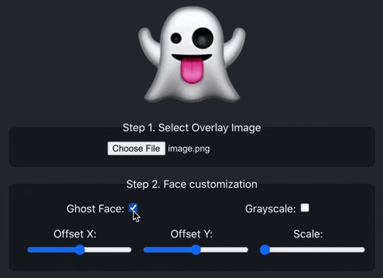
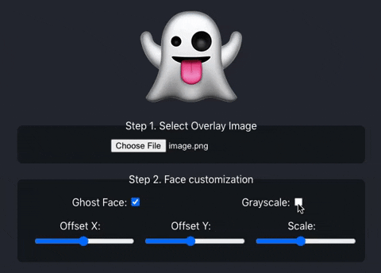
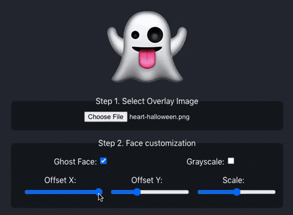
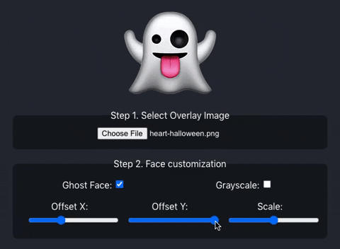
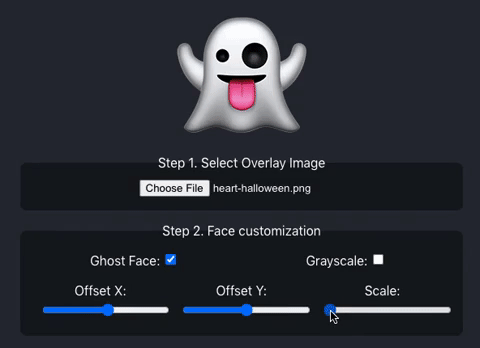

# GEAAS
👻 Ghost Emoji As A Service

https://geaas.vercel.app/

In Mexico we are very used to take goodbyes in a fun way, that's why when a colleague leaves the office we make their own emoji ghost to "honor the fallen".

The service requires a previously cut out image of the person's face and allows you to adjust it to fit the emoji. The tool has scale, grayScale, and X/Y offsets, also a way to remove the emoji's original face.

## Features:
- Ghost Face
This makes it easier for you to fit your overlay image and it will look awesome when you're done.

- Grayscale
This makes it easier for you to make the image monochromatic, which feels spookier 👻.

- Offset X
This makes it easier for you to adjust your image in the desired position from left to right and it's almost ready.

- Offset Y
Same as with Position X, this one will let you finely position your image from top to bottom, always keep your head up :)

- Scale
Small, big, all faces are born different, you can change the size of your image with no pain using this slider.

## Prerequisites
- Node.JS
- Yarn

## Installation
`yarn install`

## Usage
`yarn start`

## Run dev
`yarn dev`

# Contributing
Pull requests are welcome. For major changes, please open an issue first to discuss what you would like to change.
